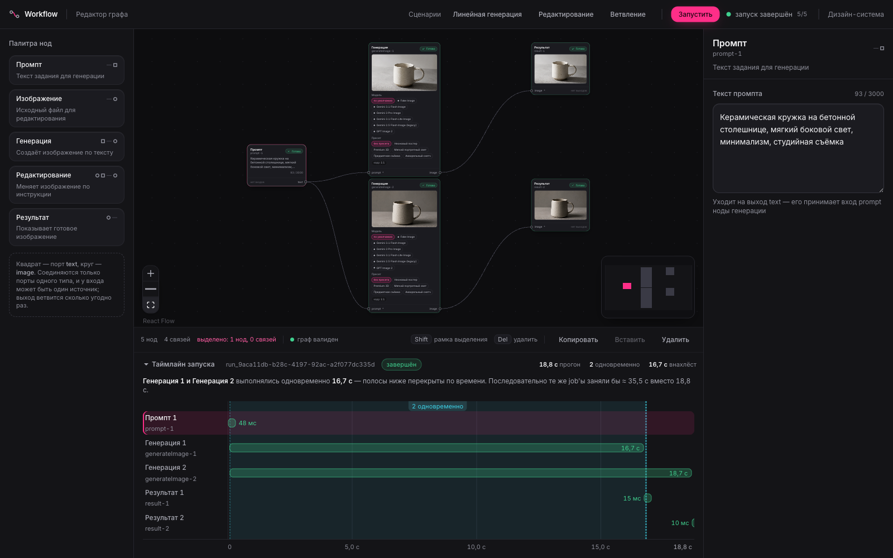
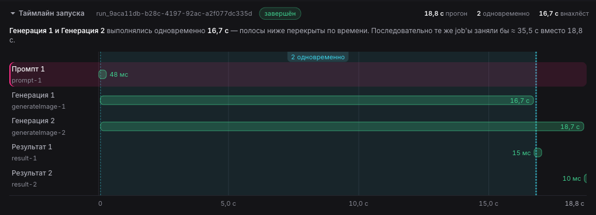
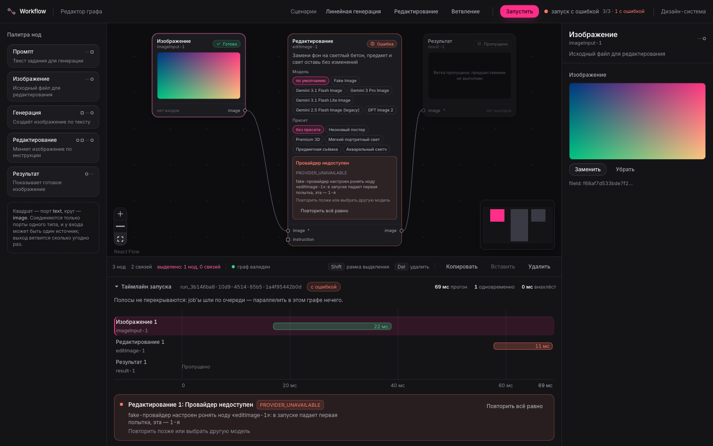

# AI Image Workflow Mini

[](https://github.com/airmalik0/ai-image-workflow-mini/actions/workflows/ci.yml)

Node-based редактор AI-воркфлоу: граф собирается мышью, исполняется на сервере очередью job'ов,
статусы идут в браузер в реальном времени. Независимые ветки выполняются одновременно, упавшую
ноду можно повторить, запуск — отменить.

**Живой стенд: <http://209.38.214.79>** — с настоящей генерацией OpenAI. Стоит суточный потолок
в 25 обращений к платному API: по исчерпании стенд честно говорит об этом плашкой и переключается
на офлайн-провайдера, а граф, очередь, статусы, retry и отмена продолжают работать по-настоящему.

Тестовое задание на позицию Fullstack-разработчика (продукт **Снэпбилд**, компания «Очень»).
Исходный текст задания — [`docs/task-original.html`](docs/task-original.html).



_Скриншот настоящий: две картинки сгенерированы OpenAI `gpt-image-2` по одному промпту за 18,8 с;
таймлайн внизу показывает, что обе генерации шли внахлёст 16,7 с._

## Запуск

```bash
git clone https://github.com/airmalik0/ai-image-workflow-mini.git
cd ai-image-workflow-mini
docker compose up
```

Открыть <http://localhost:3000>.

**AI-ключ не нужен.** Без ключей поднимается офлайн-провайдер `fake`: граф исполняется по-настоящему —
очередь, статусы в реальном времени, retry, отмена, — а картинку рисует локальный детерминированный
генератор. Всё, что описано ниже, кроме самой AI-генерации, проверяется без единого секрета.

С ключом — то же самое, но картинки настоящие:

```bash
cp .env.example .env
echo "OPENAI_API_KEY=sk-…" >> .env
docker compose up
```

Дальше: три готовых сценария из задания на пустом холсте (или своя сборка из палитры), кнопка
**Запустить**. Порты меняются переменными `WEB_PORT` и `API_PORT` в `.env`. API виден напрямую
на <http://localhost:3001>, OpenAPI — на `/api/docs`.

Локальная разработка без Docker (Node 22, pnpm 10): поднять Postgres и Redis, затем
`pnpm --filter @workflow/api dev`, `pnpm --filter @workflow/worker dev` и
`pnpm --filter @workflow/web dev`. Проверки и тесты — в разделе [Тесты и CI](#тесты-и-ci).

## Что показывает демо

Три сценария из задания загружаются в один клик:

| Сценарий           | Граф                                                     | Что проверяет                                |
| ------------------ | -------------------------------------------------------- | -------------------------------------------- |
| Линейная генерация | `Промпт → Генерация → Результат`                         | text→image, статусы, показ результата        |
| Редактирование     | `Изображение → Редактирование → Результат`               | загрузка файла, image→image по инструкции    |
| Ветвление          | `Промпт → (Генерация A, Генерация B) → (Результат A, B)` | зависимости и одновременное выполнение веток |

## Архитектура

Монорепо pnpm. Главное разделение: **оркестрация знает про граф, исполнение — нет.**

```
apps/
  web/       React 19 + Vite + @xyflow/react, Feature-Sliced Design
  api/       Fastify: REST, SSE, WebSocket, оркестрация графа
  worker/    исполнитель job'ов — тот же образ, другая команда
packages/
  contracts/ zod-схемы графа, DTO и событий — общий источник правды для фронта и бэка
  core/      домен без I/O: валидация графа, планировщик, RequestBuilder, порты
```

```
POST /api/runs
      │
      ▼
  Оркестратор (API) ── создаёт Run и Jobs, считает готовые ноды
      │                 (готова та, у которой все входы уже success)
      ▼
  Redis: очередь job'ов + pub/sub событий
      │
      ▼
  Worker ×N ── собирает запрос из уже разрешённых входов и пресета,
      │        зовёт провайдера, кладёт байты в хранилище
      │        и возвращает исход обратной очередью
      ▼
  Оркестратор ── публикует событие в pub/sub, пересчитывает готовность,
      │          ставит следующие ноды или закрывает run:
      │          completed | failed | cancelled
      ▼
  Браузер ── SSE (основной транспорт), WebSocket, polling как фолбэк
```

Воркер получает самодостаточный job и не догадывается, что он часть DAG. Поэтому исполнение
масштабируется репликами (`docker compose up --scale worker=3`), а обе половины тестируются
по отдельности. API — строго один экземпляр: состояние оркестратора живёт в памяти процесса,
и второй считал бы граф по своей копии. В `docker-compose.yml` это записано явно.

`packages/core` не импортирует ни Fastify, ни Drizzle, ни BullMQ, ни `node:fs` — это проверяется
[тестом на импорты](packages/core/src/ports/purity.test.ts), а не обещанием. Следствие: одна и та же
функция `canConnect` валидирует соединение на канвасе и на сервере, а планировщик тестируется
за миллисекунды без Docker.

Подробный разбор — [`docs/superpowers/specs/…-design.md`](docs/superpowers/specs/2026-09-02-ai-image-workflow-mini-design.md);
журнал технических решений с причинами и откатами версий — [`docs/decisions.md`](docs/decisions.md).

## По пунктам задания

| Требование                                    | Как сделано                                                                                               | Где смотреть                                                                          |
| --------------------------------------------- | --------------------------------------------------------------------------------------------------------- | ------------------------------------------------------------------------------------- |
| Canvas: add, move, connect, delete, branching | React Flow, палитра с перетаскиванием, копирование/вставка, выделение рамкой, миникарта                   | `apps/web/src/widgets/workflow-canvas`                                                |
| Typed ports `text` / `image`                  | топология портов объявлена один раз в `NODE_SPECS`; несовместимые соединения блокируются и объясняются    | `packages/contracts/src/graph/node-specs.ts`, `packages/core/src/graph/validate.ts`   |
| Пять типов нод                                | prompt, imageInput, generateImage, editImage, result                                                      | `apps/web/src/entities/node/ui`                                                       |
| Реальный вызов image-generation API           | OpenAI `gpt-image-2` — генерация, редактирование, несколько референсов одним запросом                     | `apps/api/src/providers/openai`, отчёт `docs/research/openai-images.md`               |
| Ключ не попадает во фронт                     | ключи читает только API; браузер ходит в `/api/*`, провайдера выбирает сервер                             | `apps/api/src/providers/registry.ts`                                                  |
| loading / error state, timeout                | статусы job'а на карточке, код ошибки и текст провайдера; таймаут и отмена запроса — по `AbortSignal`     | `apps/web/src/entities/node/ui/node-run-status.tsx`, `apps/api/src/providers/http.ts` |
| Preset как отдельная сущность                 | таблица в БД, CRUD по API, выбор в инспекторе; сборка запроса — в домене, не в компоненте                 | `packages/core/src/preset/request-builder.ts`, `apps/api/src/routes/presets.ts`       |
| Parallel execution независимых веток          | реактивный планировщик + семафор конкурентности; таймлайн показывает окна одновременной работы            | `packages/core/src/run/engine.ts`, `apps/web/src/widgets/run-timeline`                |
| Jobs и состояния                              | `idle → queued → running → success \| error \| skipped`                                                   | `packages/contracts/src/run.ts`                                                       |
| `POST /runs` → `runId`, `GET /runs/:id`       | плюс SSE, WebSocket и polling как фолбэк                                                                  | `apps/api/src/routes/runs.ts`                                                         |
| Retry упавшей ноды                            | повтор ноды и её потомков; успешные предки не пересчитываются — платить за них второй раз незачем         | `apps/api/src/routes/runs.ts`, `apps/web/src/features/retry-job`                      |
| FSD на фронте                                 | слои `app / pages / widgets / features / entities / shared`, границы проверяет `eslint-plugin-boundaries` | `apps/web/eslint.config.js`                                                           |

## Параллельность — не на словах

Ветвление из задания на настоящем провайдере: две генерации на один промпт.



Таймлайн считает не «сколько было job'ов», а фактические окна одновременной работы: полосы
перекрыты по времени на 16,7 с, весь прогон занял 18,8 с, последовательно те же job'ы заняли бы ≈ 35,5 с.
Число одновременных запросов ограничено сверху (`MAX_CONCURRENT_JOBS`): двадцать независимых
генераций не должны превращаться в двадцать одновременных запросов к провайдеру и в счёт на
двадцать генераций сразу.

Падение одной ветки не останавливает независимые: run не считается `completed`, пока не выполнены
все ноды, а ветка за упавшей нодой получает статус `skipped` — не «ошибка» и не «вечная очередь».

## Ошибки и повтор

Ошибка провайдера остаётся ошибкой: **тихой подмены на заглушку нет никогда**. Иначе сценарий
«нода упала → Retry» стал бы невоспроизводимым — вместо отказа пользователь получал бы нарисованную
локально картинку и не узнал бы об этом.

Чтобы посмотреть сценарий отказа, не ломая ключ, есть переменная окружения:

```bash
# заглушка уронит первую попытку ноды editImage-1 в каждом запуске;
# повтор той же ноды пройдёт
IMAGE_PROVIDER=fake FAKE_FAIL_NODES=editImage-1:1 docker compose up
```

Дальше: сценарий «Редактирование», загрузить картинку, **Запустить** — нода покажет код и текст
отказа, кнопка повтора доведёт её до результата. Ровно этот сценарий проверяется e2e-тестом
[`e2e/retry.spec.ts`](e2e/retry.spec.ts).



Код отказа показан рядом с текстом не для красоты: «что-то пошло не так» нельзя ни найти в логах,
ни соотнести с поведением, а `PROVIDER_SAFETY_BLOCKED` — можно. Повтор у неповторяемой ошибки
не исчезает, но и не предлагается вслепую: рядом сказано, что сам по себе он ничего не изменит.

## Провайдеры

| Провайдер            | Состояние                                                                            |
| -------------------- | ------------------------------------------------------------------------------------ |
| OpenAI `gpt-image-2` | основной, прогнан вживую на всех трёх сценариях                                      |
| Google Gemini        | реализован и покрыт тестами; вживую проверены ветки ошибок — у ключа кончился баланс |
| `fake`               | офлайновый, детерминированный: приложение обязано полностью работать без ключей      |

Выбор — `IMAGE_PROVIDER` (`auto` берёт первого доступного: OpenAI → Gemini → fake). Модель
выбирается на уровне ноды, а не один раз на процесс.

**Свой провайдер добавляется одним файлом.** Нужно реализовать порт
[`ImageProvider`](packages/core/src/ports/image-provider.ts) (`id`, `models`, `defaultModel`,
`capabilities`, `generate`, `edit`) — по образцу [`openai-provider.ts`](apps/api/src/providers/openai/openai-provider.ts) —
и зарегистрировать его в [`registry.ts`](apps/api/src/providers/registry.ts). Ядро, контракты
и фронт при этом не меняются: список моделей приезжает в UI из `GET /api/models`, а недостающие
возможности (нет `negativePrompt`, меньше референсов) деградируют в `RequestBuilder` сами.

Оба адаптера написаны на голом `fetch`, без SDK. Причина для Gemini разобрана в
[`docs/research/gemini-api.md`](docs/research/gemini-api.md): SDK тянет 29 МБ ради одного POST'а
и мутирует глобальный undici-диспетчер процесса.

## Отступления от задания и почему

- **Добавлен статус `skipped`.** В ТЗ пять состояний job'а. Шестое понадобилось для ветки за
  упавшей нодой: `error` там врёт (нода не запускалась), `idle` — тоже (она уже не запустится).
- **Realtime сделан тремя транспортами.** SSE основной, WebSocket — потому что в требованиях
  realtime стоит отдельным пунктом, а SSE односторонний; polling документирован как фолбэк.
  У каждого SSE-события есть `id:`, поэтому `Last-Event-ID` действительно докачивает пропущенное,
  а история не очищается при retry — иначе поздно подключившийся клиент не узнал бы о падении.
- **Preset Editor не делался** — задание прямо говорит, что он не нужен. Есть CRUD по API,
  выбор в инспекторе и пять пресетов в сиде.
- **Очередь BullMQ + Redis — не оверинжиниринг.** Она нужна, чтобы отделить оркестрацию от
  исполнения: без общей шины API не узнал бы о прогрессе воркера, а воркер не масштабировался бы
  отдельно.
- **Загрузка изображений — `multipart/form-data`**, не base64 в JSON: первая же фотография
  с телефона упирается в лимит тела запроса.
- **У пресетов из сида нет референсов и нет прибитой модели.** Референсные картинки сида
  нарисованы кодом, а боевая модель такой референс не «учитывает как стиль», а копирует —
  вместо отредактированной фотографии приезжает нарисованная сфера. Прибитая модель вендора
  ломала бы пресет на стенде с ключом другого провайдера. Оба поля есть в контракте и
  работают у пользовательских пресетов; картинки сида лежат готовым набором, но по умолчанию
  ни к чему не прицеплены.

## Что сознательно не сделано

- **Аутентификация и мультипользовательность** — вне рамок задания.
- **Собственный canvas-engine** — задание прямо говорит не писать с нуля.
- **Версионирование пресетов и промптов** — интересно продукту, за рамками теста.
- **Observability-стек** (метрики, трейсинг) — есть структурные логи с `runId` и `jobId`.
- **Kubernetes и автоскейлинг** — вместо этого воркер масштабируется репликами compose.

## Тесты и CI

```bash
pnpm install
pnpm test        # 446 тестов: домен, API, фронт, слой данных
pnpm e2e         # 3 сценария Playwright против собранного стенда
pnpm lint && pnpm typecheck && pnpm build
```

`pnpm test` без поднятых Postgres, Redis и MinIO не падает — интеграционные наборы снимаются
с прогона и печатают команду, которой их поднять. В CI пропуск запрещён явной проверкой: иначе
зелёная сборка могла бы не проверить ни слой данных, ни очередь, ни хранилище.

`pnpm e2e` сам поднимает стенд (`docker compose up --build` с заглушкой вместо провайдера) и ходит
через nginx, а не в dev-сервер: так проверяются и проксирование SSE, и раздача файлов, и то, что
фронт действительно собран.

Что проверено против настоящей инфраструктуры, а не моков:

- репозитории — против живого Postgres, и дважды: реализация на Drizzle и ин-мемори эталон
  прогоняются одним набором тестов, расхождение падает как обычный тест;
- S3-адаптер — против живого MinIO (мок S3 проверил бы только то, что мы правильно вызвали свой мок);
- загрузка файла — настоящим JPEG в 3 МБ: побайтовое сравнение скачанного в тестах и отдельно живым curl
  против поднятого сервера;
- SSE — тесты проверяют инкрементальную доставку, поле `id:` и докачку по `Last-Event-ID`, а на живом
  стенде за nginx тайминги отдельных событий показали, что поток идёт потоком, а не одним ответом в конце;
- провайдеры — живыми запросами, отчёты в `docs/research/`.

## Переменные окружения

Полный список с комментариями — [`.env.example`](.env.example). Ключевые:

| Переменная                          | Смысл                                                                  |
| ----------------------------------- | ---------------------------------------------------------------------- |
| `IMAGE_PROVIDER`                    | `auto` (по умолчанию), `openai`, `gemini`, `fake`                      |
| `OPENAI_API_KEY` / `GEMINI_API_KEY` | ключи; без них поднимается `fake`                                      |
| `MAX_CONCURRENT_JOBS`               | сколько job'ов оркестратор отдаёт в исполнение одновременно            |
| `WORKER_CONCURRENCY`                | сколько job'ов тянет один процесс-воркер                               |
| `FAKE_FAIL_NODES`                   | заглушка роняет названные ноды: `id` — всегда, `id:N` — первые N раз   |
| `DEMO_DAILY_LIMIT`                  | суточный потолок обращений к платному провайдеру для публичного стенда |
| `STORAGE_DRIVER`                    | `fs` или `s3` (любое S3-совместимое хранилище)                         |

Секретов в репозитории нет: `.env` в `.gitignore`, в репозитории лежит только список переменных.

## Как это делалось

Разработка велась с AI-агентом (Claude Code) по написанной заранее спецификации и плану на 27 задач —
оба лежат в `docs/superpowers/`. Дисциплина была такая:

1. **Сначала разведка, потом код.** Оба провайдера прощупаны живыми запросами до реализации, отчёты
   в `docs/research/`. Например, выяснилось, что у Gemini отказ модели приходит с HTTP 200 и пустым
   `inlineData` при заполненном `finishReason`, а поля negative prompt нет ни у одного из двух — обе особенности изменили дизайн, а не
   всплыли в проде.
2. **TDD по шагам плана**: красный тест → реализация → зелёный → коммит.
3. **Проверка вживую, а не «должно работать».** Всё, что заявлено выше как проверенное, действительно
   запускалось: живая генерация, curl с настоящим файлом, чистый клон и `docker compose up`,
   e2e против собранного стенда.
4. **Журнал решений.** Каждое неочевидное решение и каждый откат версии записаны в `docs/decisions.md`
   с причиной — почти полсотни записей.

---

## In English (short)

**AI Image Workflow Mini** — a node-based AI workflow editor: build a graph in the browser, run it
on the server as a queue of jobs, watch statuses in real time. Independent branches run in parallel;
failed nodes can be retried, and runs can be cancelled.

```bash
docker compose up   # → http://localhost:3000
```

**No AI key required**: without keys the app starts on a deterministic offline provider and everything
except the actual AI generation works for real. With `OPENAI_API_KEY` in `.env` the images are real
(OpenAI `gpt-image-2`).

Architecture in three lines: a pnpm monorepo where **orchestration is separated from execution** —
the API knows the graph and enqueues ready nodes, the worker executes self-contained jobs and knows
nothing about the DAG, Redis pub/sub carries events back, and the browser receives them over SSE
(WebSocket and polling are available as alternatives). The domain core (`packages/core`) has no I/O
at all — graph validation, the scheduler and the request builder are pure, which is enforced by a test,
so the very same validation runs in the browser and on the server.

Tests: 446 unit/integration (`pnpm test`, real Postgres, Redis and MinIO) plus 3 Playwright end-to-end
scenarios against the built Docker stack (`pnpm e2e`). CI runs all of it without any API keys.
